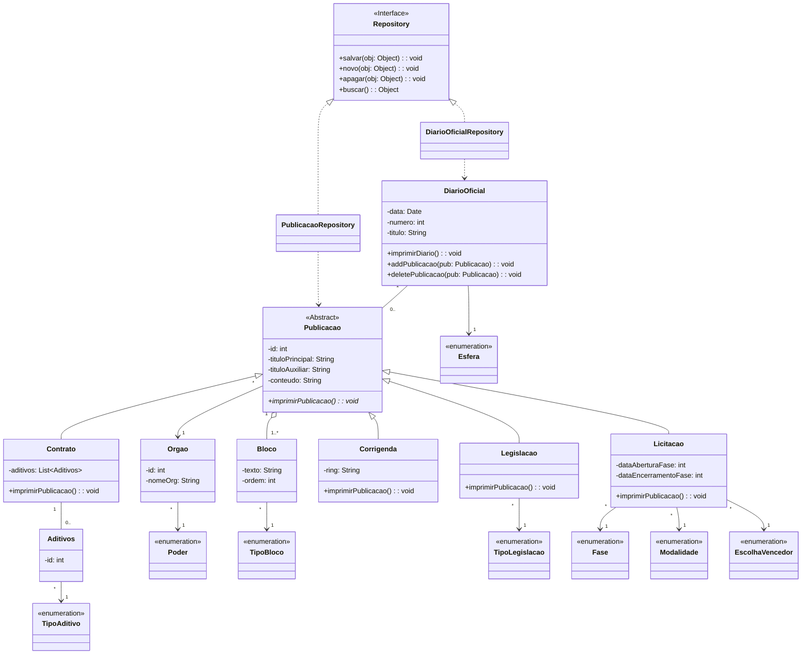

```mermaid
classDiagram
    class DiarioOficial {
        -data: Date
        -numero: int
        -titulo: String
        +imprimirDiario(): void
        +addPublicacao(pub: Publicacao): void
        +deletePublicacao(pub: Publicacao): void
    }
    class Publicacao {
        <<Abstract>>
        -id: int
        -tituloPrincipal: String
        -tituloAuxiliar: String
        -conteudo: String
        +imprimirPublicacao()*: void
    }
    class Bloco {
        -texto: String
        -ordem: int
    }
    class Orgao {
        -id: int
        -nomeOrg: String
    }
    class Legislacao {
        +imprimirPublicacao(): void
    }
    class Corrigenda {
        -ring: String
        +imprimirPublicacao(): void
    }
    class Licitacao {
        -dataAberturaFase: int
        -dataEncerramentoFase: int
        +imprimirPublicacao(): void
    }
    class Contrato {
        -aditivos: List~Aditivos~
        +imprimirPublicacao(): void
    }
    class Aditivos {
        -id: int
    }
    class Esfera {<<enumeration>>}
    class Poder {<<enumeration>>}
    class TipoBloco {<<enumeration>>}
    class TipoLegislacao {<<enumeration>>}
    class Fase {<<enumeration>>}
    class Modalidade {<<enumeration>>}
    class EscolhaVencedor {<<enumeration>>}
    class TipoAditivo {<<enumeration>>}
    class Repository {
        <<Interface>>
        +salvar(obj: Object): void
        +novo(obj: Object): void
        +apagar(obj: Object): void
        +buscar(): Object
    }
    class DiarioOficialRepository
    class PublicacaoRepository

    Publicacao <|-- Legislacao
    Publicacao <|-- Corrigenda
    Publicacao <|-- Licitacao
    Publicacao <|-- Contrato
    Repository <|.. DiarioOficialRepository
    Repository <|.. PublicacaoRepository
    DiarioOficial "1" -- "0.." Publicacao
    Contrato "1" -- "0.." Aditivos
    Publicacao "1" o-- "1..*" Bloco
    DiarioOficialRepository ..> DiarioOficial
    PublicacaoRepository ..> Publicacao
    DiarioOficial --> "1" Esfera
    Publicacao "*" --> "1" Orgao
    Bloco "*" --> "1" TipoBloco
    Orgao "*" --> "1" Poder
    Legislacao "*" --> "1" TipoLegislacao
    Licitacao "*" --> "1" Fase
    Licitacao "*" --> "1" Modalidade
    Licitacao "*" --> "1" EscolhaVencedor
    Aditivos "*" --> "1" TipoAditivo
```
