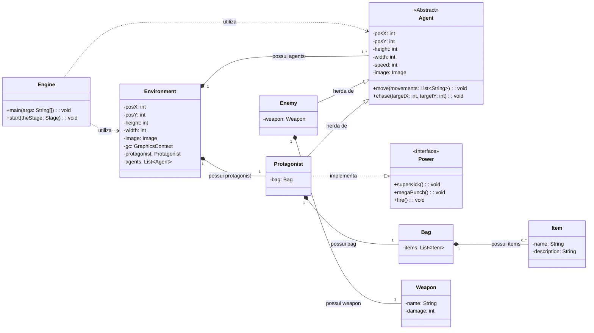

```mermaid
classDiagram
    direction LR

    class Engine {
        +main(args: String[]): void
        +start(theStage: Stage): void
    }

    class Environment {
        -posX: int
        -posY: int
        -height: int
        -width: int
        -image: Image
        -gc: GraphicsContext
        -protagonist: Protagonist
        -agents: List~Agent~
    }

    class Agent {
        <<Abstract>>
        -posX: int
        -posY: int
        -height: int
        -width: int
        -speed: int
        -image: Image
        +move(movements: List~String~): void
        +chase(targetX: int, targetY: int): void
    }

    class Protagonist {
        -bag: Bag
    }

    class Enemy {
        -weapon: Weapon
    }

    class Power {
        <<Interface>>
        +superKick(): void
        +megaPunch(): void
        +fire(): void
    }

    class Bag {
        -items: List~Item~
    }

    class Weapon {
        -name: String
        -damage: int
    }

    class Item {
        -name: String
        -description: String
    }

    Protagonist --|> Agent : herda de
    Enemy --|> Agent : herda de

    Protagonist ..|> Power : implementa

    Environment "1" *-- "1..*" Agent : possui agents
    Environment "1" *-- "1" Protagonist : possui protagonist
    Protagonist "1" *-- "1" Bag : possui bag
    Enemy "1" *-- "1" Weapon : possui weapon
    Bag "1" *-- "0..*" Item : possui items

    Engine ..> Environment : utiliza
    Engine ..> Agent : utiliza
```
