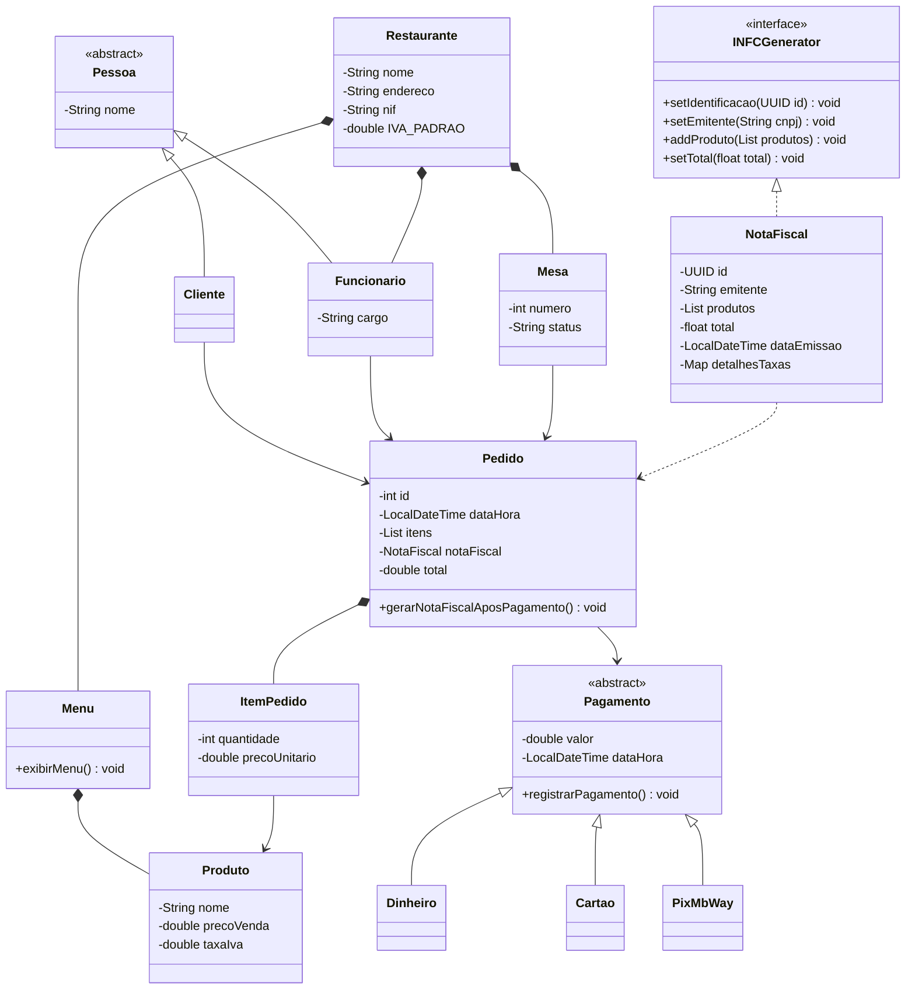

```mermaid
classDiagram
    class Pessoa {
        <<abstract>>
        -String nome
    }

    class Cliente {
    }

    class Funcionario {
        -String cargo
    }

    class Restaurante {
        -String nome
        -String endereco
        -String nif
        -double IVA_PADRAO
    }

    class Menu {
        +exibirMenu() void
    }

    class Produto {
        -String nome
        -double precoVenda
        -double taxaIva
    }

    class Mesa {
        -int numero
        -String status
    }

    class Pedido {
        -int id
        -LocalDateTime dataHora
        -List itens
        -NotaFiscal notaFiscal
        -double total
        +gerarNotaFiscalAposPagamento() void
    }

    class ItemPedido {
        -int quantidade
        -double precoUnitario
    }

    class Pagamento {
        <<abstract>>
        -double valor
        -LocalDateTime dataHora
        +registrarPagamento() void
    }

    class Dinheiro {
    }

    class Cartao {
    }

    class PixMbWay {
    }

    class INFCGenerator {
        <<interface>>
        +setIdentificacao(UUID id) void
        +setEmitente(String cnpj) void
        +addProduto(List produtos) void
        +setTotal(float total) void
    }

    class NotaFiscal {
        -UUID id
        -String emitente
        -List produtos
        -float total
        -LocalDateTime dataEmissao
        -Map detalhesTaxas
    }

    Pessoa <|-- Cliente
    Pessoa <|-- Funcionario
    Pagamento <|-- Dinheiro
    Pagamento <|-- Cartao
    Pagamento <|-- PixMbWay

    INFCGenerator <|.. NotaFiscal

    Restaurante *-- Menu
    Restaurante *-- Funcionario
    Restaurante *-- Mesa
    Menu *-- Produto
    Pedido *-- ItemPedido

    Cliente --> Pedido
    Funcionario --> Pedido
    Mesa --> Pedido
    Pedido --> Pagamento
    ItemPedido --> Produto

    NotaFiscal ..> Pedido
```
