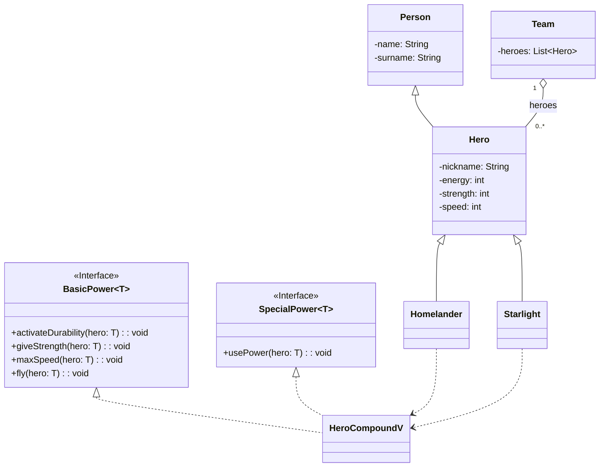

```mermaid
classDiagram
    class Person {
        -name: String
        -surname: String
    }

    class Hero {
        -nickname: String
        -energy: int
        -strength: int
        -speed: int
    }

    class Team {
        -heroes: List~Hero~
    }

    class Homelander
    class Starlight

    class BasicPower~T~ {
        <<Interface>>
        +activateDurability(hero: T): void
        +giveStrength(hero: T): void
        +maxSpeed(hero: T): void
        +fly(hero: T): void
    }

    class SpecialPower~T~ {
        <<Interface>>
        +usePower(hero: T): void
    }

    class HeroCompoundV

    %% --- Relacionamentos ---

    %% Herança
    Person <|-- Hero
    Hero <|-- Homelander
    Hero <|-- Starlight

    %% Associação (Agregação)
    Team "1" o-- "0..*" Hero : heroes

    %% Implementação
    BasicPower <|.. HeroCompoundV
    SpecialPower <|.. HeroCompoundV

    %% Dependência
    Homelander ..> HeroCompoundV
    Starlight ..> HeroCompoundV
```
